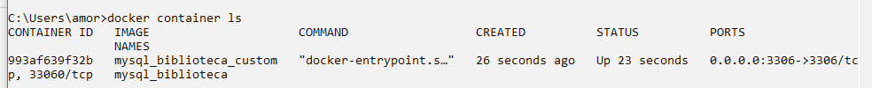
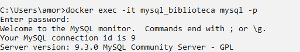
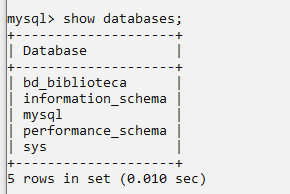
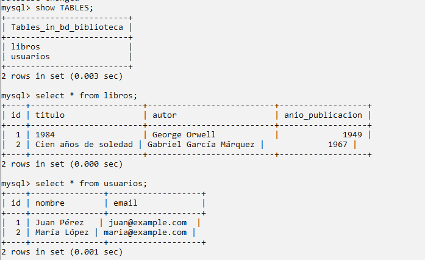

# Proyecto 3 - Construir un contenedor de mysql y su ejecución

## Objetivo

Creación de una base de datos, usuario y password del usuario así como el root
MYSQL_DATABASE=bd_biblioteca \
    MYSQL_USER=user_biblioteca \
    MYSQL_PASSWORD=pass_biblioteca \
    MYSQL_ROOT_PASSWORD=root_pass

- creación de la estructura y su carga inicial
- Comprobación desde mysql
- Comprobación desde VisualStudioCode y/o WorkBech y/o Netbeans

## Crea la siguiente estructura

```
10xFCProyecto3/

├── Dockerfile 

└── init/ 

    ├── 1-schema.sql 
    
    └── 2-datos.sql
```

## Desde la raíz del proyecto, construye la imagen

```docker
docker build -t mysql_biblioteca_custom .
```

## Ejecutar el contenedor

``` docker
docker run -d --name mysql_biblioteca  -p 3306:3306 -v mysql_data:/var/lib/mysql mysql_biblioteca_custom
```

## Comprobar imagen, contenedor y volumen



## Ejecutar comandos en el contenedor.


### Mostrar bases de datos



### Usar base de datos, que tablas y su contenido
